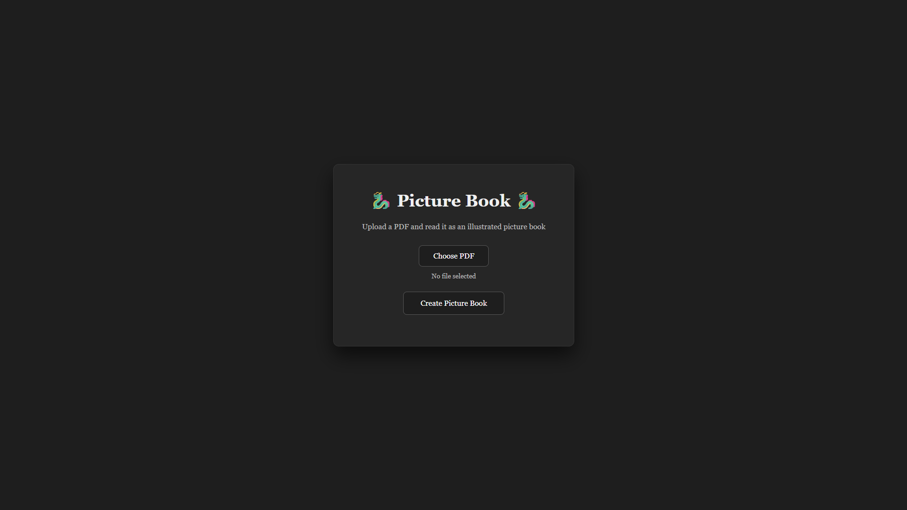
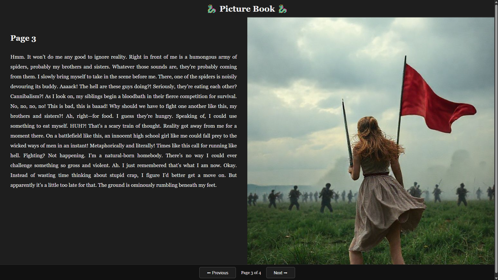

# 🐉 PictureBook 🐉

PictureBook converts a PDF book into an interactive illustrated reader.

## Screenshots

## Upload Page


## Reader View


## Features
- Upload PDF
- Extract text per page
- Detect important events
- Generate AI images
- Full-screen reader UI
- Page-by-page navigation

## Tech Stack
- FastAPI
- Python
- NLP (NLTK)
- Pollinations AI (image generation)
- HTML / CSS / JavaScript

## Run Locally

```bash
git clone https://github.com/parthambekar2004/picturebook.git
cd picturebook
python -m venv venv
venv\Scripts\activate
pip install -r requirements.txt
uvicorn app.main:app --reload
